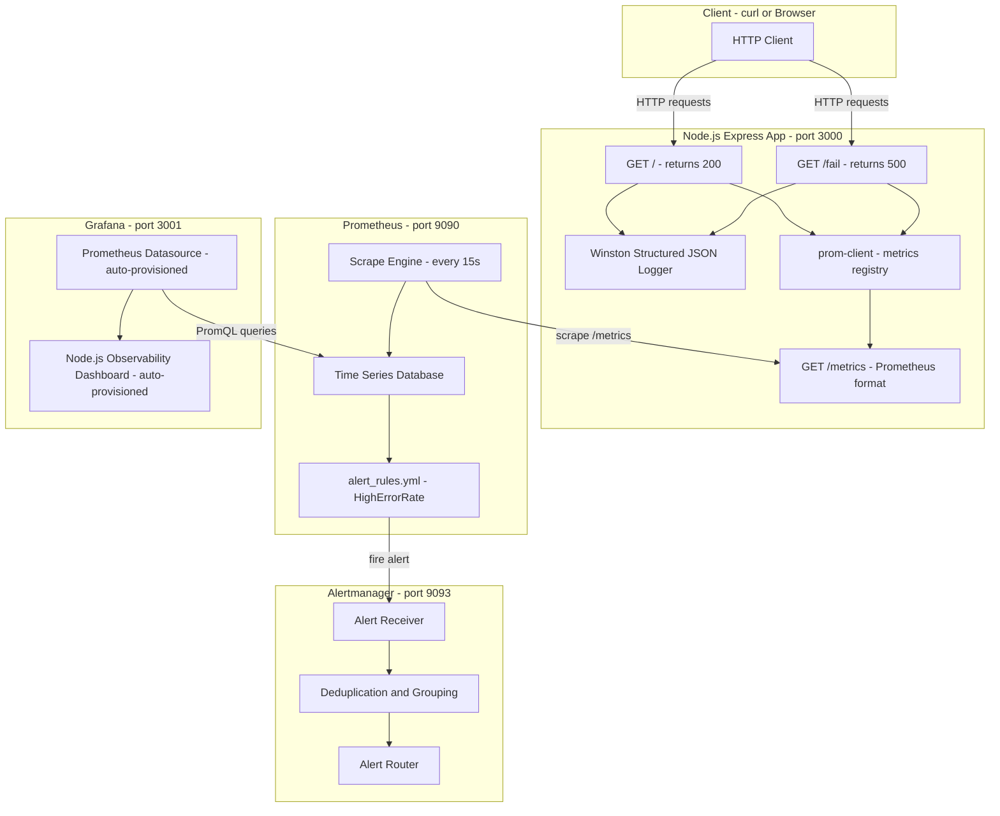
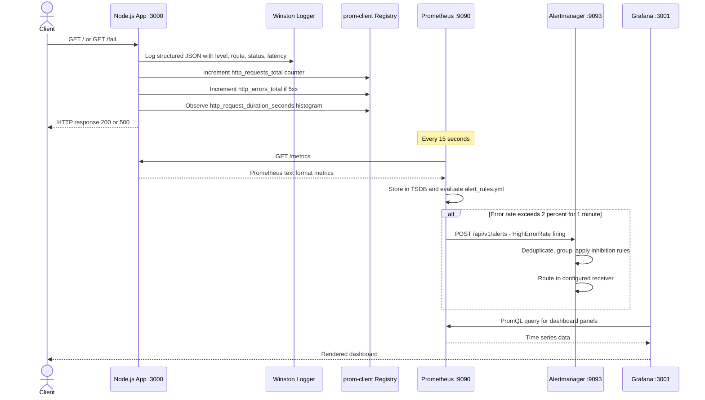
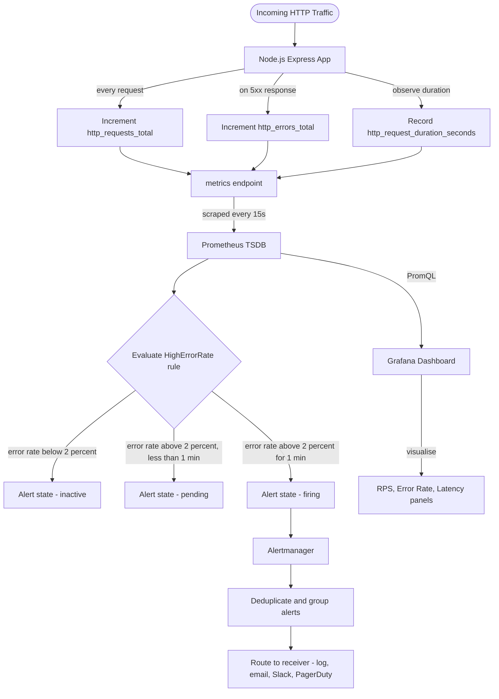
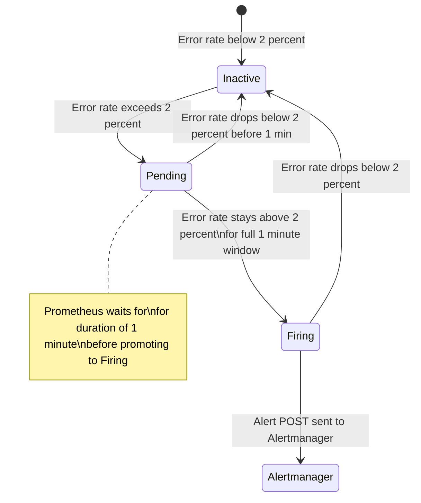

# Node.js Observability Stack !

> A production-grade observability system for Node.js Express services — featuring structured logging with Winston, metrics collection with Prometheus, real-time dashboards with Grafana, and alert routing with Alertmanager. Fully containerised with Docker Compose. One command to run the entire stack.

---

[](LICENSE)
[](https://nodejs.org/)
[](https://expressjs.com/)
[](https://prometheus.io/)
[](https://grafana.com/)
[](https://docs.docker.com/compose/)
[](https://github.com/winstonjs/winston)

---

## Table of Contents

- [Overview](#overview)
- [System Architecture](#system-architecture)
- [Data Flow](#data-flow)
- [Alert Pipeline](#alert-pipeline)
- [Tech Stack](#tech-stack)
- [Project Structure](#project-structure)
- [Prerequisites](#prerequisites)
- [Quick Start](#quick-start)
- [Generating Traffic](#generating-traffic)
- [Service Reference](#service-reference)
- [PromQL Reference](#promql-reference)
- [Alert Rule — HighErrorRate](#alert-rule--higherrorrate)
- [Grafana Dashboard Panels](#grafana-dashboard-panels)
- [Troubleshooting](#troubleshooting)
- [License](#license)

---

## Overview

This repository provides a complete, plug-and-play observability stack that can be dropped in front of any Node.js Express service. It covers the three pillars of observability in a unified Docker Compose environment:

- **Logs** — Winston outputs structured JSON to stdout, consumable by any log aggregation system
- **Metrics** — `prom-client` instruments the Express app with request rate, error rate, and latency histograms, exposed on `/metrics` for Prometheus to scrape
- **Alerts** — Prometheus evaluates `alert_rules.yml` on every scrape cycle and routes firing alerts to Alertmanager, which handles deduplication, grouping, and delivery

Key design decisions:

- **Zero manual setup**: Grafana datasources and dashboards are auto-provisioned via `provisioning/` YAML configs — no clicking through the UI after `docker-compose up`
- **Single scrape target**: Prometheus scrapes only the Node.js app's `/metrics` endpoint. Grafana and Alertmanager have no direct dependency on the app — all data flows through Prometheus
- **`sum()` aggregation in alert rules**: The HighErrorRate alert uses `sum()` to collapse label cardinality before division, preventing silent alert failures caused by Prometheus label mismatch on binary operations
- **Multi-stage Dockerfile**: The Node.js image uses a multi-stage build to keep the production image lean — dev dependencies and build tooling are excluded from the final layer

---

## System Architecture



---

## Data Flow



---

## Alert Pipeline



---

## Tech Stack

| Component | Technology | Version | Purpose |
|---|---|---|---|
| Runtime | Node.js | 20 LTS | JavaScript runtime |
| Framework | Express | 4.x | HTTP server and routing |
| Logging | Winston | 3.x | Structured JSON log output |
| Metrics client | prom-client | 15.x | Prometheus metrics instrumentation |
| Metrics store | Prometheus | 2.53 | Scraping, TSDB, alert evaluation |
| Dashboards | Grafana | 11.1 | Real-time metrics visualisation |
| Alerting | Alertmanager | 0.27 | Alert deduplication and routing |
| Containers | Docker + Docker Compose | Latest | Full stack orchestration |

---

## Project Structure

```
nodejs-observability-stack/
|
+-- app.js                           # Express application - GET /, /fail, /metrics
+-- instrumentation.js               # Winston logger + prom-client metrics registry
+-- package.json                     # Node.js dependencies
+-- Dockerfile                       # Multi-stage Docker build for Node.js app
+-- docker-compose.yml               # Full 4-service stack orchestration
+-- runbook.md                       # Incident response runbook
+-- .gitignore
|
+-- prometheus/
|   +-- prometheus.yml               # Scrape config - target: nodejs-app:3000
|   +-- alert_rules.yml              # HighErrorRate alert rule definition
|
+-- alertmanager/
|   +-- alertmanager.yml             # Receiver config - route, group, inhibit rules
|
+-- grafana/
    +-- dashboards/
    |   +-- node-dashboard.json      # Pre-built Grafana dashboard JSON
    +-- provisioning/
        +-- datasources/
        |   +-- datasource.yml       # Auto-configure Prometheus as datasource
        +-- dashboards/
            +-- dashboard.yml        # Auto-load dashboards from disk on startup
```

---

## Prerequisites

| Requirement | Version | Notes |
|---|---|---|
| Docker | v20+ | [docs.docker.com/get-docker](https://docs.docker.com/get-docker/) |
| Docker Compose | v2+ | Bundled with Docker Desktop |

Ports that must be free before starting:

| Port | Service |
|---|---|
| 3000 | Node.js Express App |
| 3001 | Grafana |
| 9090 | Prometheus |
| 9093 | Alertmanager |

---

## Quick Start

### Step 1 — Clone the Repository

```bash
git clone https://github.com/hardikkaurani/nodejs-observability-stack.git
cd nodejs-observability-stack
```

### Step 2 — Start the Entire Stack

```bash
docker-compose up --build
```

This single command builds the Node.js image and starts all four services. First run pulls base images — subsequent starts are instant.

### Step 3 — Verify All Services Are Running

```bash
docker-compose ps
# All four services should show status: Up
```

### Step 4 — Open the Dashboards

| Service | URL | Credentials |
|---|---|---|
| Node.js App | http://localhost:3000 | — |
| Prometheus | http://localhost:9090 | — |
| Grafana | http://localhost:3001 | admin / admin |
| Alertmanager | http://localhost:9093 | — |

Grafana opens with the Node.js Observability Dashboard **already configured** — no manual datasource or dashboard setup required.

---

## Generating Traffic

### Normal Traffic

```bash
# Single request
curl http://localhost:3000/

# Continuous traffic - Linux / macOS
while true; do curl -s http://localhost:3000/ > /dev/null; sleep 0.5; done
```

```powershell
# Continuous traffic - Windows PowerShell
while ($true) {
  Invoke-WebRequest -Uri http://localhost:3000/ -UseBasicParsing | Out-Null
  Start-Sleep -Milliseconds 500
}
```

### Error Traffic — Trigger the HighErrorRate Alert

```bash
# Linux / macOS - send 100 errors
for i in $(seq 1 100); do curl -s http://localhost:3000/fail > /dev/null; done
```

```powershell
# Windows PowerShell - send 100 errors
1..100 | ForEach-Object {
  Invoke-WebRequest -Uri http://localhost:3000/fail -UseBasicParsing | Out-Null
}
```

> The HighErrorRate alert requires error rate above 2% **sustained for 1 minute**. Mix `/fail` requests with some `/` requests to keep the app producing traffic while errors accumulate above the threshold.

---

## Service Reference

### Node.js App — port 3000

| Endpoint | Method | Response | Purpose |
|---|---|---|---|
| `/` | GET | 200 OK | Simulates a successful request |
| `/fail` | GET | 500 Error | Simulates a failing request |
| `/metrics` | GET | Prometheus text | Exposes all instrumented metrics |

### Prometheus — port 9090

- **Targets**: http://localhost:9090/targets — verify `nodejs-app` shows state `UP`
- **Alerts**: http://localhost:9090/alerts — view HighErrorRate alert state (inactive / pending / firing)
- **Graph**: http://localhost:9090/graph — run ad-hoc PromQL queries

### Grafana — port 3001

- **Login**: admin / admin
- **Dashboard**: Dashboards > Node.js Observability Dashboard
- No manual configuration needed — datasource and dashboard are auto-provisioned on startup

### Alertmanager — port 9093

- View active, silenced, and inhibited alerts
- Default receiver logs alerts to stdout (visible in `docker logs`)

---

## PromQL Reference

```promql
# Total request rate per second (1m window)
sum(rate(http_requests_total[1m]))

# Error rate as a percentage
(sum(rate(http_errors_total[1m])) / sum(rate(http_requests_total[1m]))) * 100

# 50th percentile latency
histogram_quantile(0.50, sum by (le) (rate(http_request_duration_seconds_bucket[1m])))

# 95th percentile latency
histogram_quantile(0.95, sum by (le) (rate(http_request_duration_seconds_bucket[1m])))

# 99th percentile latency
histogram_quantile(0.99, sum by (le) (rate(http_request_duration_seconds_bucket[1m])))

# Total errors (cumulative counter)
sum(http_errors_total)
```

---

## Alert Rule — HighErrorRate

### Rule Definition

```yaml
# prometheus/alert_rules.yml
groups:
  - name: nodejs
    rules:
      - alert: HighErrorRate
        expr: >
          (
            sum(rate(http_errors_total[1m]))
            /
            sum(rate(http_requests_total[1m]))
          ) * 100 > 2
        for: 1m
        labels:
          severity: warning
        annotations:
          summary: "High error rate detected"
          description: "Error rate is {{ $value | printf \"%.2f\" }}% — threshold is 2%"
```

### Why `sum()` Is Required

`http_errors_total` carries the label `{route}`.
`http_requests_total` carries the labels `{method, route, status}`.

When Prometheus evaluates a binary operation between two metrics, it performs **label matching** — it tries to pair time series by their shared label set. Because these two metrics have **different label cardinalities**, Prometheus finds no matching pairs and the division returns empty results. The alert would never fire — a dangerous silent failure.

Wrapping both sides in `sum()` removes all labels, collapsing each metric to a single scalar:

```promql
sum(rate(http_errors_total[1m]))    -- single scalar e.g. 0.5
sum(rate(http_requests_total[1m]))  -- single scalar e.g. 10.0

0.5 / 10.0 = 0.05 * 100 = 5% -- alert fires
```

### Alert State Machine



---

## Grafana Dashboard Panels

| Panel | PromQL | Description |
|---|---|---|
| Requests Per Second | `sum(rate(http_requests_total[1m]))` | Live request throughput |
| Error Rate % | `(sum(rate(http_errors_total[1m])) / sum(rate(http_requests_total[1m]))) * 100` | Percentage of requests returning 5xx |
| Total Errors | `sum(http_errors_total)` | Cumulative error counter since start |
| p50 Latency | `histogram_quantile(0.50, sum by (le) (rate(http_request_duration_seconds_bucket[1m])))` | Median response time |
| p95 Latency | `histogram_quantile(0.95, sum by (le) (rate(http_request_duration_seconds_bucket[1m])))` | 95th percentile response time |
| p99 Latency | `histogram_quantile(0.99, sum by (le) (rate(http_request_duration_seconds_bucket[1m])))` | 99th percentile response time |

---

## Stopping the Stack

```bash
# Stop all services - data volumes preserved
docker-compose down

# Stop and remove all data volumes - full reset
docker-compose down -v
```

---

## Troubleshooting

| Symptom | Likely Cause | Fix |
|---|---|---|
| Port already in use | Another service is on 3000, 3001, 9090, or 9093 | Stop the conflicting service or remap ports in `docker-compose.yml` |
| Prometheus target shows DOWN | App container not running or unhealthy | `docker-compose ps` and `docker logs <app-container>` |
| Grafana dashboard shows No Data | Prometheus has not scraped yet | Wait 30 seconds after startup, then refresh |
| HighErrorRate alert not firing | Error rate below threshold or not sustained for 1 minute | Send sustained error traffic for over 60 seconds |
| Alert fires but no notification received | Alertmanager receiver not configured for external delivery | Edit `alertmanager/alertmanager.yml` to add email, Slack, or PagerDuty receiver |
| Container crash loop | Misconfigured YAML or port conflict | `docker logs <container-name> --tail 100` |

---

## Extending the Stack

- **Add a new metric**: Define a new `Counter`, `Gauge`, or `Histogram` in `instrumentation.js` using `prom-client`, then instrument the relevant Express route in `app.js`
- **Add a new alert**: Append a new rule block to `prometheus/alert_rules.yml` — Prometheus hot-reloads rules on the next scrape cycle without a restart
- **Add an external notification channel**: Configure a receiver in `alertmanager/alertmanager.yml` — Alertmanager supports email, Slack, PagerDuty, OpsGenie, and webhooks natively
- **Add a new Grafana panel**: Edit `grafana/dashboards/node-dashboard.json` directly or use the Grafana UI and export the updated JSON back to the file

---

## License

MIT License. See [LICENSE](LICENSE) for details.

---

## Contact

- **Author**: Hardik Kaurani
- **Email**: hardikkaurani1@gmail.com
- **Repository**: [github.com/hardikkaurani/nodejs-observability-stack](https://github.com/hardikkaurani/nodejs-observability-stack)

---

*Production observability — logs, metrics, dashboards, and alerts in one command.*
